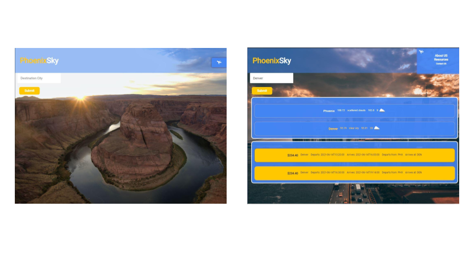
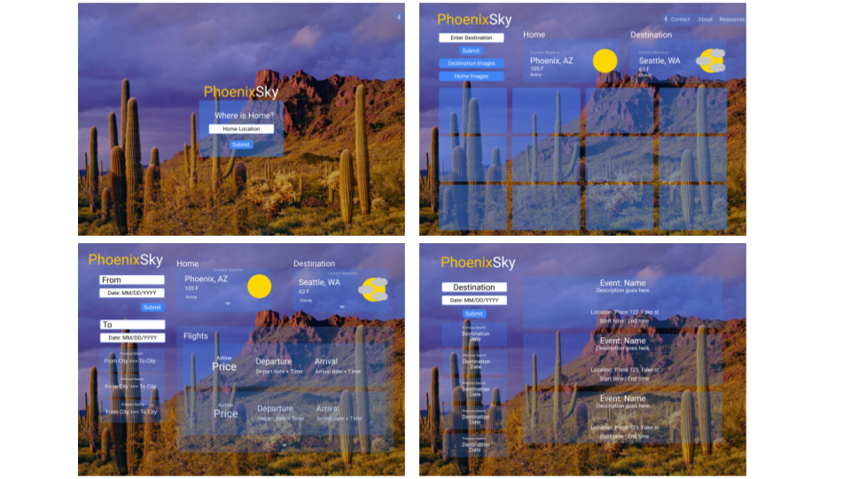
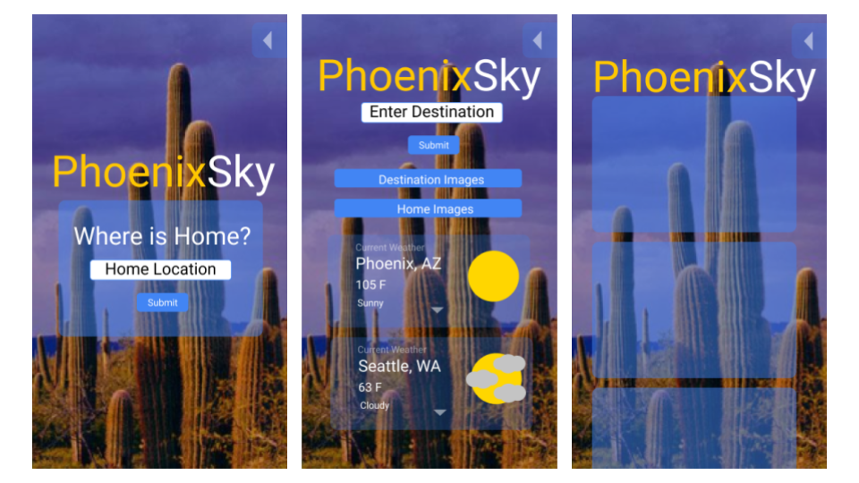

# PhoenixSky
A trip planning resource!


## Overview
PhoenixSy is made to give its users a starting point on their trip planning, letting them see detailed information about their destination with minimal input, only having to enter their desired destination and letting the site do everything else for them.


## Criteria
* Uses two or more server-side APIs
* Cannot use Boot-Srap.
* Uses client-side storage.
* Has a clean and polished U.I.
* Meets accessibility standards.
* Does not use alerts, confirms, or prompts.


## Design


Ui aesthetics and input simplified with integration of APIs. Users current location is captured from their IP Address and used as the origin location for flight and weather information. Background image changes to a random image associated with the user's input as flight information is searched for.


## Technologies Used
[AMADEUS](https://developers.amadeus.com/self-service/apis-docs)

API Used to create flight information.
```
https://developers.amadeus.com/self-service/apis-docs
```

[ABSTRACT](https://app.abstractapi.com/dashboard)

API Captures User information
```
https://app.abstractapi.com/dashboard
```

[UNSPLASH](https://unsplash.com/developers)

API Generates background image based on user input
```
https://unsplash.com/developers
```

[OPENWEATHER](https://openweathermap.org/api)

API Used to gather information about destination
```
https://openweathermap.org/api
```


## Concept
Users will visit the site and be able to see flight information, the weather at their location and the background image of their destination.




UI will be placed over a splash image. Navigation Bar is collapsable to free up window space for other functionality.



Site will be responsive and reorganize into a single column when window is at smallest setting.

Ideas for future functionality
* International travel options
* Add Destination Event search
* Multiple Image display


## Links
[REPOSITORY](https://github.com/stongems/PhoenixSky/tree/main)
```
https://github.com/stongems/PhoenixSky/tree/main
```

[DEPLOYED](https://stongems.github.io/PhoenixSky/)
```
https://stongems.github.io/PhoenixSky/
```
